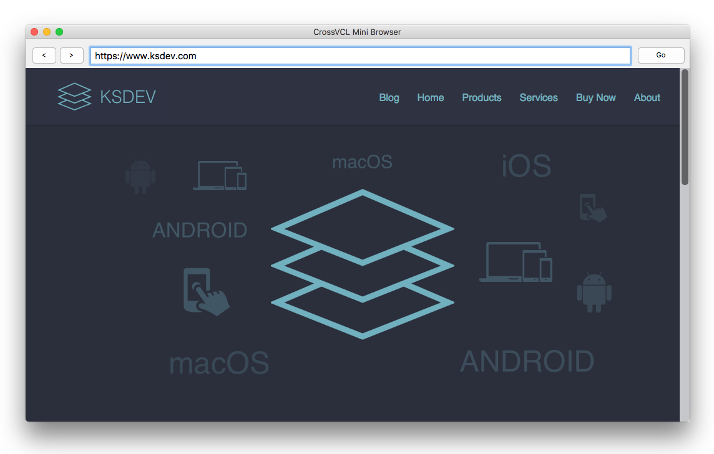
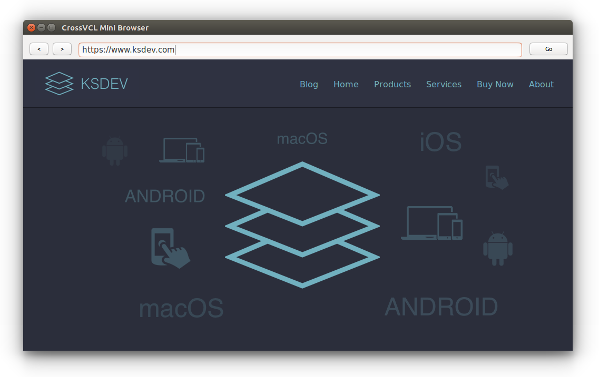
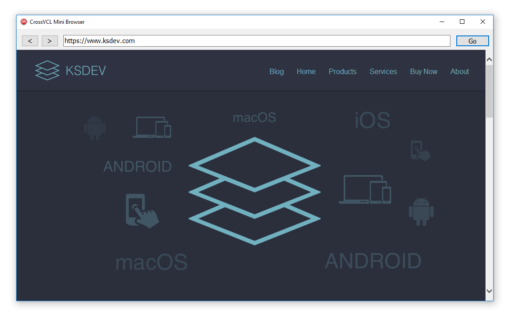

# CrossVCL WebView Components (CrossWebView)

Cross-platform TWebView component for CrossVcl (https://www.crossvcl.com). 

# Overview

VCL and and CrossVCL WebBrowser component based on native web arch on each platforms:

* Windows: SHDocVw.TWebBrowser
* macOS: WebView
* Linux: GtkWebKit 

# Requirements

Windows version works with Delphi version testes on Delphi Tokyo. MacOS and Linux version requires CrossVcl from http://www.crossvcl.com

# License

Remember that this library and its source code are distributed under terms of Mozilla Public License (MPL) version 2.0. By using this product, you acknowledge your consent to be bound by the terms of MPL.

If you need to use this framework for a project with a different licensing requirements, feel free to contact the author for more options.

Copyright (c) 2018 Eugene Kryukov

http://www.ksdev.com